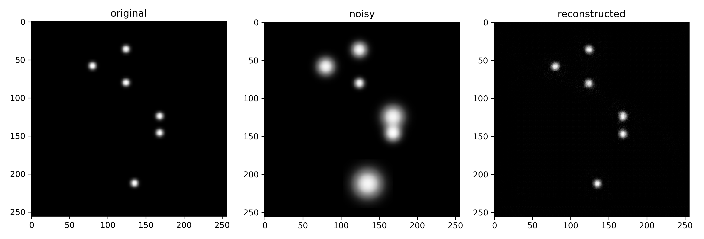
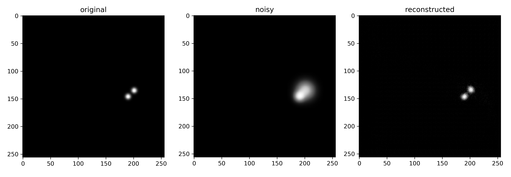

# Galaxy focalization
This project is a proof of concept with synthetic data of how it may be possible to enhance the resolution of telescope images of distant galaxies using denoising convolutional neural networks.

I have tried several techniques, the most promising is possibly the use of transfer learning (VGG16 model) toghether with custom convolutional layers.

Here you can see in the column "original" the test set image to which was added a Gaussian radial blur, the "noisy" image and the one "reconstructed" by the Convolutional Neural Network.

In this proof of concept all of the sources had the same intensity. For further experiments one may want to use sources of **different** intensities, add other kinds of noise and train the model longer. 